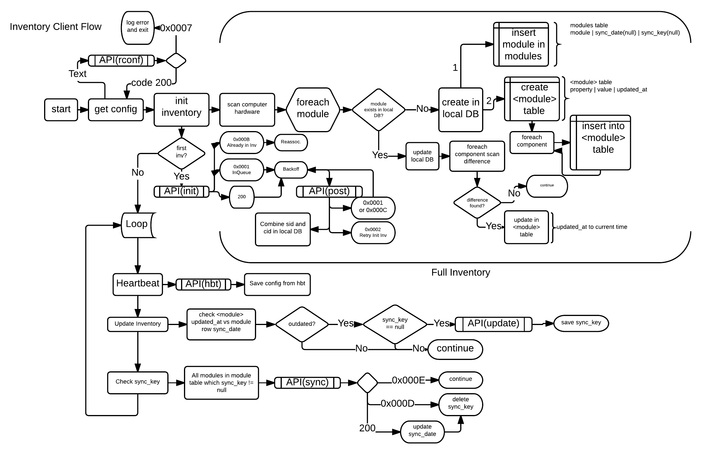

## Python Inventory Client Simulator

Written by Christopher Sidell

## Configuration (config.json)

**store**: Where are the generated computers stored

**pool**: The component pool, generally hardware is randomly chosen

**system_count**: How many computers to simulate

**setup**:
- 1 - Remove old computers, generate new
- 2 - Use old computers, generate new computers up to system count

**simulation**:
- 1 - Run simulation
- 2 - Stop

**gui**: t/f Show gui

**inv_path**: Inventory configuration path

**tickrate**: The rate at which the computer threads tick

## GUI Explanation

When running the simulation you will be given a popup window that shows you what is happening. On each row you're given two indicators the activity indicator and the power indicator.

*Activity*: A red blip mean a tick has occurred

*Power*: Green means on, black means off

## Inventory Configuration (invconfig.json)

**api**: The DNS of the api server, DO NOT PUT HTTP OR HTTPS

**keypub**: The key distributed to the clients to authenticate to the server on first request

### Per-computer instance config

**loglevel**: What level of logging is to be kept on each client
- 0 - Fatal
- 1 - Error
- 2 - Warning
- 3 - Notice
- 4 - Info

**logfile**: What file to write to in the virtual environment

### Diagram
